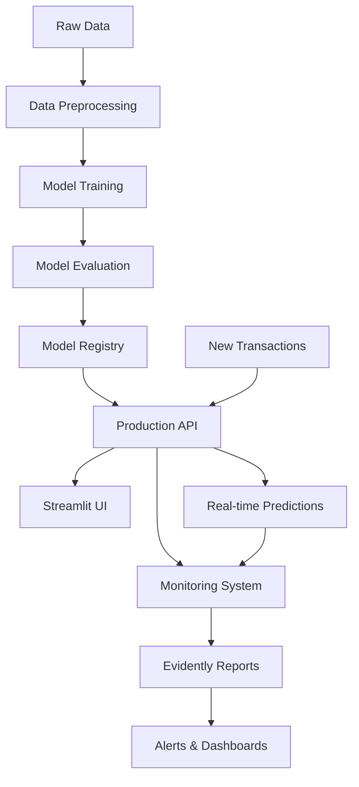

# MLOps Project – Credit Card Fraud Detection

## 🎯 Project Objective

Build a complete MLOps pipeline to automatically detect fraudulent credit card transactions using machine learning techniques. This project demonstrates best practices in data versioning, experiment tracking, model deployment, and production monitoring.

## 🏗️ Architecture Overview



## 🔗 Pipeline Components

### 1. Data Version Control (DVC)
- **Purpose**: Track and version datasets throughout the ML lifecycle
- **Workflow**:
  - Raw data stored in `data/raw/creditcard.csv`
  - Preprocessing pipeline defined in `dvc.yaml`
  - Processed data versioned in `data/processed/creditcard_processed.csv`
  - Reproducible data pipeline with `dvc repro`

### 2. Experiment Tracking (MLflow)
- **Purpose**: Track model experiments, parameters, and metrics
- **Features**:
  - Automatic logging of hyperparameters and metrics
  - Model registry for version control
  - UI dashboard for experiment comparison
  - Integration with training pipeline

### 3. Model Training
- **Algorithm**: Logistic Regression (baseline model)
- **Features**: 30 PCA-transformed features + normalized Amount
- **Metrics**: ROC-AUC, Precision-Recall AUC
- **Validation**: Stratified train/test split (80/20)

### 4. API Service (FastAPI)
- **Framework**: FastAPI for high-performance REST API
- **Endpoints**:
  - `/predict` - Real-time fraud prediction
  - `/health` - Service health check
  - `/metrics` - Model performance metrics
  - `/monitoring/*` - Drift detection endpoints

### 5. Monitoring & Drift Detection (Evidently)
- **Data Drift**: Statistical tests for feature distribution changes
- **Model Drift**: Performance degradation detection
- **Reports**: Automated JSON and HTML reports
- **Visualization**: Interactive dashboards

### 6. CI/CD Pipeline (GitHub Actions)
- **Continuous Integration**: Automated testing and code quality checks
- **Continuous Deployment**: Automatic deployment to Railway
- **Branch Strategy**: 
  - `dev-clean` → Staging environment
  - `main` → Production environment

## 🚀 Getting Started

### Prerequisites
- Python 3.10+
- Docker & Docker Compose
- Git
- DVC (Data Version Control)

### Local Development Setup

1. **Clone the repository**:
   ```bash
   git clone <repository-url>
   cd mlops-fraud
   ```

2. **Install dependencies**:
   ```bash
   pip install -r requirements.txt
   pip install -r src/model/requirements.txt
   pip install -r ui/requirements.txt
   ```

3. **Initialize DVC**:
   ```bash
   dvc init
   dvc pull  # Download processed data
   ```

4. **Start services locally**:
   ```bash
   # Terminal 1: Start API
   uvicorn src.api:app --host 0.0.0.0 --port 8000 --reload
   
   # Terminal 2: Start UI
   streamlit run ui/app.py --server.port 8501
   ```

### Docker Deployment

1. **Build and run with Docker Compose**:
   ```bash
   docker-compose up --build
   ```

2. **Access services**:
   - API: http://localhost:8000
   - UI: http://localhost:8501
   - MLflow: http://localhost:5000

### Individual Docker Images

Build specific services:
```bash
# Build API
docker build -f docker/api.Dockerfile -t fraud-api .

# Build UI
docker build -f docker/ui.Dockerfile -t fraud-ui .

# Build Training
docker build -f docker/train.Dockerfile -t fraud-train .
```

## 🔍 API Usage

### Health Check
```bash
curl -X GET http://localhost:8000/health
```

### Fraud Prediction
```bash
curl -X POST http://localhost:8000/predict \
  -H "Content-Type: application/json" \
  -d '{
    "features": [0.1, -0.2, 0.3, -0.4, 0.5, -0.6, 0.7, -0.8, 0.9, -1.0, 
                 1.1, -1.2, 1.3, -1.4, 1.5, -1.6, 1.7, -1.8, 1.9, -2.0, 
                 2.1, -2.2, 2.3, -2.4, 2.5, -2.6, 2.7, -2.8, 2.9, -3.0]
  }'
```

### Get Metrics
```bash
curl -X GET http://localhost:8000/metrics
```

### Run Data Drift Check
```bash
curl -X POST http://localhost:8000/monitoring/drift/check
```

### Run Model Drift Check
```bash
curl -X POST http://localhost:8000/monitoring/model/check
```

## 🖥️ Streamlit UI Usage

1. **Access the dashboard**: Open http://localhost:8501 in your browser
2. **Navigation**:
   - **Prediction**: Enter transaction features for fraud prediction
   - **Monitoring**: View real-time model performance metrics
   - **Data Drift**: Analyze feature distribution changes
   - **Model Drift**: Monitor model performance degradation

## 📊 Monitoring with Evidently

### Data Drift Detection
- **Method**: Kolmogorov-Smirnov test for each feature
- **Threshold**: p-value < 0.05 indicates drift
- **Reporting**: Automated JSON and HTML reports
- **Visualization**: Interactive feature drift charts

### Model Drift Detection
- **Metrics Monitored**:
  - ROC-AUC score changes
  - Fraud prediction rate shifts
  - Average prediction probability variations
  - Abnormal probability detections
- **Alerting**: Automatic drift detection with detailed reports

### Request Logging
All production predictions are logged in `logs/requests/` with:
- Timestamp
- Input features
- Model prediction
- Prediction probability

## 🔄 CI/CD Pipeline

### Continuous Integration
Triggered on push/PR to `main` or `dev-clean`:
1. **Testing**: Pytest execution across Python 3.10 and 3.11
2. **Code Quality**: Flake8 linting and style checks
3. **Docker Tests**: Container build and health checks

### Continuous Deployment
Automatic deployment to Railway:
- **Staging**: Push to `dev-clean` branch
- **Production**: Push to `main` branch
- **Services**: API and UI deployed separately

## 📁 Project Structure
```
mlops-fraud/
├── data/
│   ├── raw/              # Original datasets
│   └── processed/        # Preprocessed datasets
├── src/
│   ├── api.py           # FastAPI service
│   ├── train.py         # Model training
│   ├── data_preprocess.py # Data preprocessing
│   ├── evaluate_model.py # Model evaluation
│   ├── model/           # Trained model artifacts
│   └── monitoring/      # Drift detection scripts
├── ui/
│   ├── app.py           # Streamlit dashboard
│   └── requirements.txt # UI dependencies
├── docker/              # Docker configuration files
├── .github/workflows/   # CI/CD pipelines
├── tests/               # Unit and integration tests
├── logs/                # Production request logs
├── reports/             # Monitoring reports
├── mlruns/             # MLflow experiment data
└── dvc.yaml            # DVC pipeline definition
```

## 🛠️ Development Commands

### Data Pipeline
```bash
# Reproduce entire pipeline
dvc repro

# Push data to remote storage
dvc push

# Pull data from remote storage
dvc pull
```

### Model Training
```bash
# Train model locally
python src/train_model.py

# Evaluate model
python src/evaluate_model.py
```

### Testing
```bash
# Run unit tests
pytest tests/

# Run specific test file
pytest tests/test_api.py
```

### Code Quality
```bash
# Linting
flake8 .

# Formatting (if black is installed)
black .
```

## 🌐 Production Deployment

### Railway Deployment
- **API Service**: [https://fraud-api-production.up.railway.app](https://fraud-api-production.up.railway.app)
- **UI Service**: [https://fraud-ui-production.up.railway.app](https://fraud-ui-production.up.railway.app)

### Monitoring Endpoints
- **Health Check**: `/health`
- **Metrics**: `/metrics`
- **Data Drift**: `/monitoring/drift/check`
- **Model Drift**: `/monitoring/model/check`

## 🤝 Contributing

1. Fork the repository
2. Create a feature branch (`git checkout -b feature/AmazingFeature`)
3. Commit your changes (`git commit -m 'Add some AmazingFeature'`)
4. Push to the branch (`git push origin feature/AmazingFeature`)
5. Open a Pull Request

## 📄 License

This project is licensed under the MIT License - see the [LICENSE](LICENSE) file for details.

## 🙏 Acknowledgments

- Dataset provided by Kaggle
- Powered by FastAPI, Streamlit, MLflow, and Evidently
- Built with ❤️ using modern MLOps practices